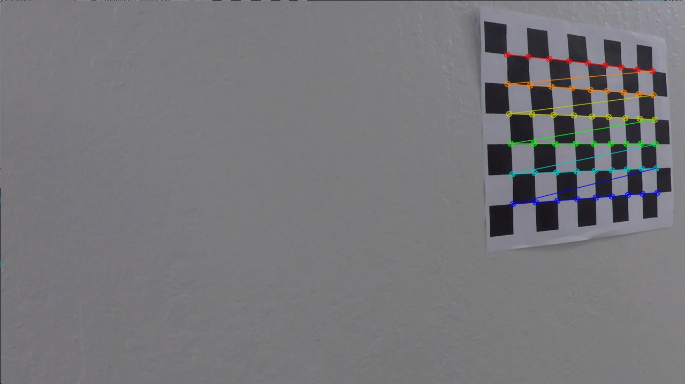
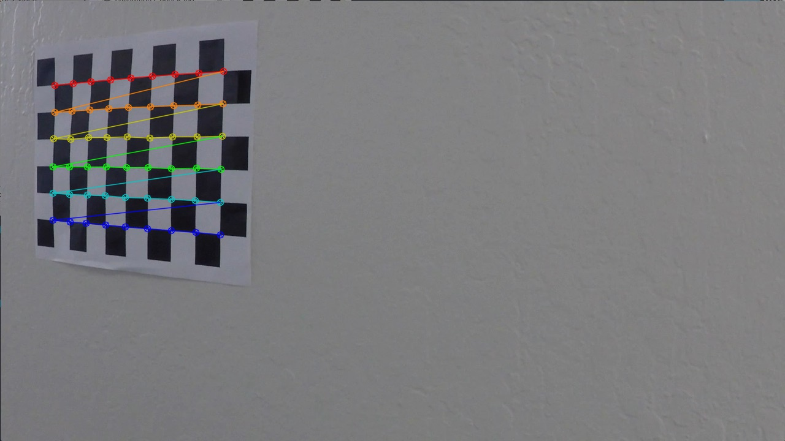
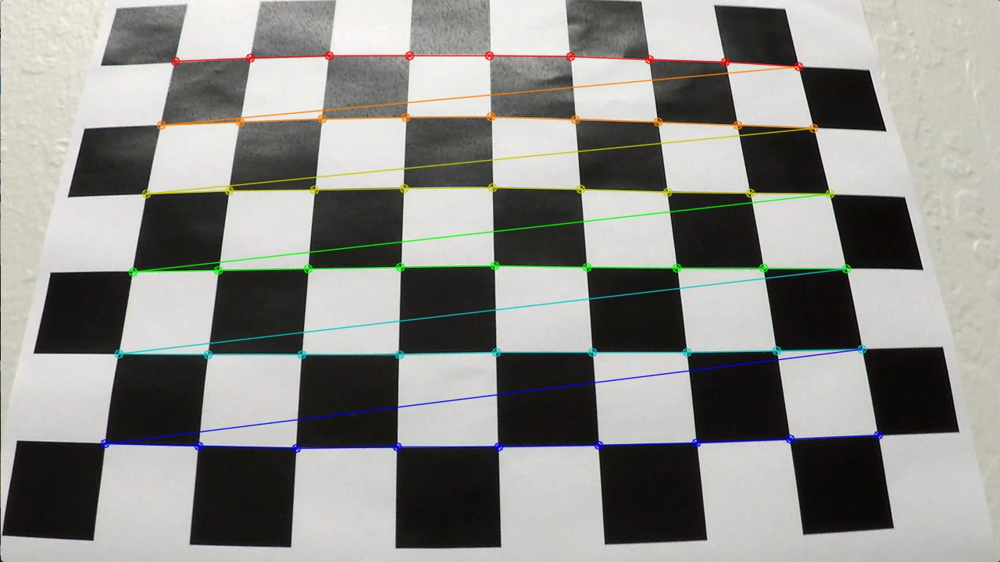
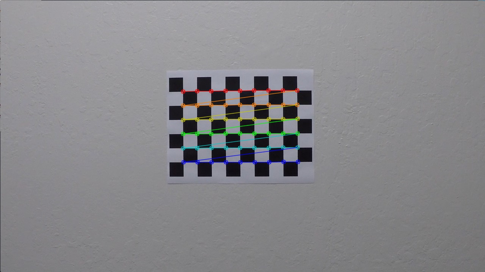
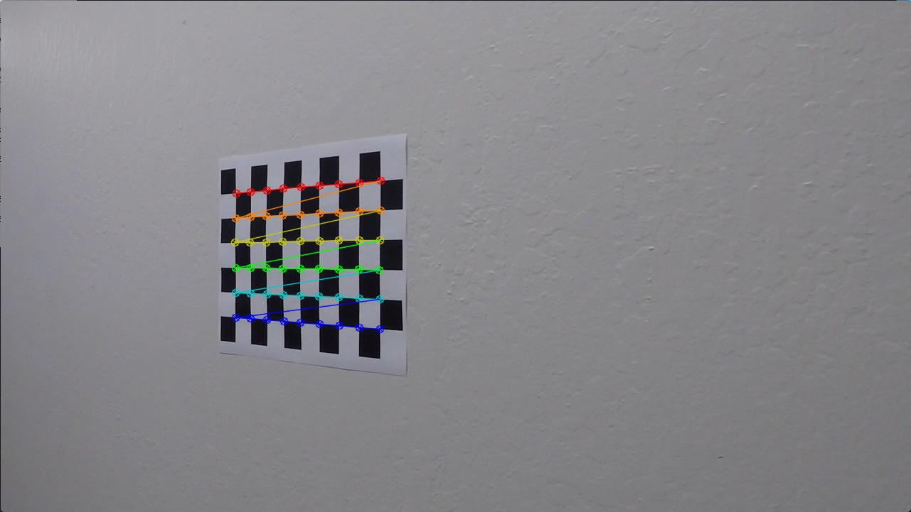

## Writeup

**Advanced Lane Finding Project**

The goals / steps of this project are the following:

* Compute the camera calibration matrix and distortion coefficients given a set of chessboard images.
* Apply a distortion correction to raw images.
* Use color transforms, gradients, etc., to create a thresholded binary image.
* Apply a perspective transform to rectify binary image ("birds-eye view").
* Detect lane pixels and fit to find the lane boundary.
* Determine the curvature of the lane and vehicle position with respect to center.
* Warp the detected lane boundaries back onto the original image.
* Output visual display of the lane boundaries and numerical estimation of lane curvature and vehicle position.

[//]: # (Image References)

[image1]: ./camera_cal/calibration2.jpg "Chessboard"
[image2]: ./images_output/test1/test1_0.jpg "Undistorted"
[image3]: ./images_output/test1/test1_1.jpg "Perspective Transform"
[image4]: ./images_output/test1/test1_2.jpg "Color & Gradient Thresholds"
[image5]: ./images_output/test1/test1_3.jpg "Detect lines"
[image6]: ./examples/example_output.jpg "Output"
[video1]: ./project_video.mp4 "Video"

## [Rubric](https://review.udacity.com/#!/rubrics/571/view) Points

### Here I will consider the rubric points individually and describe how I addressed each point in my implementation.  

---

### Writeup / README

#### 1. Provide a Writeup / README that includes all the rubric points and how you addressed each one.  You can submit your writeup as markdown or pdf.  [Here](https://github.com/udacity/CarND-Advanced-Lane-Lines/blob/master/writeup_template.md) is a template writeup for this project you can use as a guide and a starting point.  

You're reading it!

### Camera Calibration

#### 1. Briefly state how you computed the camera matrix and distortion coefficients. Provide an example of a distortion corrected calibration image.

The code for this step is contained in the main function (from line 515 to line 531 of the file called pipeline.py) and in the *get_points_for_calibration()* function:

```python
### Camera calibration ###
if os.path.exists(calibration_file):
        print("Read in the calibration data\n")
        calibration_pickle = pickle.load(open(calibration_file, "rb"))
        mtx = calibration_pickle["mtx"]
        dist = calibration_pickle["dist"]
    else:
        print("Calibrate camera...")
        objpoints, imgpoints = get_points_for_calibration(9, 6)
        img = cv2.imread('./test_images/test1.jpg')
        ret, mtx, dist, rvecs, tvecs = cv2.calibrateCamera(objpoints, imgpoints, img.shape[1::-1], None, None)

        print("Save the camera calibration result for later use\n")
        calibration_pickle = {}
        calibration_pickle["mtx"] = mtx
        calibration_pickle["dist"] = dist
        pickle.dump(calibration_pickle, open(calibration_file, "wb"))
```

![Chessboard][image1]

The chessboard pattern used for calibration contains 9 and 6 corners in the horizontal and vertical directions, respectively (as shown above). First, I start by preparing "object points", which will be the (x, y, z) coordinates of the chessboard corners in the world. Here I am assuming the chessboard is fixed on the (x, y) plane at z=0, such that the object points are the same for each calibration image. Those object points are stored in the list `objp`:

```python
def get_points_for_calibration(nx, ny):
    # Prepare object points
    objp = np.zeros((ny*nx,3), np.float32)
    objp[:,:2] = np.mgrid[0:nx, 0:ny].T.reshape(-1,2)
```

For each chessboard image, taken from different angles with the same camera, we retrieve the (x,y) pixel position of the chessboard corners using the OpenCV function `findChessboardCorners`. Those points are then appended to the `imgpoints` list, whereas the `objp` are appended to the `objpoints` list for each succcessful chessboard detection:

```python
# Find chessboard corners (for an 9x6 board)
        ret, corners = cv2.findChessboardCorners(img, (nx,ny), None)

        if (ret == True):
            objpoints.append(objp)
            imgpoints.append(corners)
```

I then used the output `objpoints` and `imgpoints` to compute the camera calibration and distortion coefficients using the `cv2.calibrateCamera()` function:

```python
ret, mtx, dist, rvecs, tvecs = cv2.calibrateCamera(objpoints, imgpoints, img.shape[1::-1], None, None)
```

Below, you can see the detected corners drawn on each chessboard image:

||
------------ | ------------- | ------------
||
||
||
||
|

In order to do not compute camera matrix and distortion coefficients every time, I saved them in a pickle file to reuse them every time I run my pipeline for the project videos (see pipeline.py from line 515 to 531).

### Pipeline (single images)

The pipeline created for this project processes images in the following steps:

- **Step 1**: Apply distortion correction using a computed camera calibration matrix and distortion coefficients.
- **Step 2**: Apply a perspective transformation to warp the image to a birds eye view perspective of the lane lines.
- **Step 3**: Apply color and gradient thresholds to create a binary image which isolates the pixels representing lane lines.
- **Step 4**: Detect the lane line pixels and fit a polynomial for the left and right lane boundaries.
- **Step 5**: Compute radius of curvature of the lane and vehicle position from the lane center.
- **Step 6**: Unwarp the detected lane boundaries back onto the original image
- **Step 7**: Output data information of the lane onto the image with step 3 and 4 for debugging.

You can find the steps in the function called `process_img` in lines 466 through 512 in the class `Line`.

#### 1. Provide an example of a distortion-corrected image.

Images from the camera have been undistorted using the camera calibration matrix and distortion coefficients computed previously. I applied this distortion correction to the test images using the `cv2.undistort()` function:

```python 
def process_img(self, img, output_dir = "", file_name = "", save_steps = False):

        ### 1. Distortion correction ###
        undistorted = cv2.undistort(img, mtx, dist, None, mtx)
```

An example of an image before and after the distortion correction step is shown below:

![Distortion correction][image2]

#### 2. Describe how (and identify where in your code) you performed a perspective transform and provide an example of a transformed image.

The code for my perspective transform includes a function called `perspective_transform()`, which appears in lines 130 through 140 in the file `pipeline.py`.  The `perspective_transform()` function takes as inputs the image to process (`img`). The source (`src`) and destination (`dst`) points are defined inside that function.

I chose to do not hardcode the source and destination points as I couldn't get consistent and satisfying results when trying it.
Hence I've used the image shape and a predefined offset as follow:

```python
def perspective_transform(img):
    img_size = (img.shape[0], img.shape[1])
    # Define src and dst points
    x_center = img_size[1]/2
    x_offset=120
    src = np.float32([(x_offset,img_size[0]), (x_center-54, 450), (x_center+54, 450), (img_size[1]-x_offset,img_size[0])])
    dst = np.float32([(x_offset,img_size[1]), (x_offset,0), (img_size[0]-x_offset, 0), (img_size[0]-x_offset,img_size[1])])
    # Apply transform
    M = cv2.getPerspectiveTransform(src, dst)
    Minv = cv2.getPerspectiveTransform(dst, src)
    return (cv2.warpPerspective(img, M, (img_size[0], img_size[1]), flags=cv2.INTER_LINEAR), Minv)
```

Using the OpenCV `getPerspectiveTransform` and `warpPerspective` I obtain the following result:

![Perspective transform][image3]

#### 3. Describe how (and identify where in your code) you used color transforms, gradients or other methods to create a thresholded binary image.  Provide an example of a binary image result.

I used a combination of color and gradient thresholds to generate a binary image (thresholding steps at lines 55 through 128 in `pipeline.py`). Here's an example of my output for this step:

![Binary image][image4]

#### 4. Describe how (and identify where in your code) you identified lane-line pixels and fit their positions with a polynomial?

The lane detection was performed using histogram method with sliding window, but also using history along the video frames, in the `sliding_windows_polyfit` function. The latter works only if the lane has been correctly detected in some previous frames. A sanity check based on the polynomial fits and the radius of curvature of the lanes are used to validate the lane detection. If too many frames don't pass the sanity check, the pipeline reverts to the first method (histogram and sliding window) until the lane is detected again.

##### 4.1 - Historgram and sliding windows

The first step is to compute a histogram of the lower half image (see lines 156 through 161). It gives me the 2 pics where the lanes are located.

After that, the sliding window method is used to extract the lane pixels from the bottom to the top of the image (see lines 176 through 196). It's done by dividing the image into 9 horizontal strips. Each strip (starting from the bottom) is processed one after the other, where a fixed window is centered around the x position of the non zero pixels. Those pixels are appended to the lists `left_lane_inds` and `right_lane_inds`.

These lists are then are used with `np.polyfit` to compute a second order polynomial that fits the points:

```python
# Concatenate the arrays of indices
    left_lane_inds = np.concatenate(left_lane_inds)
    right_lane_inds = np.concatenate(right_lane_inds)

    # Extract left and right line pixel positions
    leftx = nonzerox[left_lane_inds]
    rightx = nonzerox[right_lane_inds]
    lefty = nonzeroy[left_lane_inds]
    righty = nonzeroy[right_lane_inds]

    # Fit a second order polynomial to each
    left_fit = np.polyfit(lefty, leftx, 2)
    right_fit = np.polyfit(righty, rightx, 2)
```

##### 4.2 - History

This method is used to speed up processing with videos once a lane has already been detected before. Previously detected lanes are used to define regions of interest where the lanes are likely to be in. The algorithm uses the base points of the previous lanes to find all non-zero pixels around it in the current image. No histogram is computed in this case, and the windows searching is done once on the entire frame.

This is implemented in the `sliding_windows_polyfit` function in lines 198 through 212.

##### 4.3 - Sanity check

As mentionned before a sanity check is done on each frame to validate the detection regardless of what method is used. It is defined in the function `` in lines 428 through 442:

```python
def sanity_check(self, left_fit, right_fit, left_curv_radius, right_curv_radius, top_lane_width, bottom_lane_width):
        # Check that both lines have similar curvature
        if abs(left_curv_radius - right_curv_radius) > 1500:
            return False

        # Check that both lines are separated by approximately the right distance horizontally
        lane_width = (top_lane_width + bottom_lane_width) / 2
        if abs(2.0 - lane_width) > 0.5:
            return False

        # Check that both lines are roughly parallel
        if abs(top_lane_width - bottom_lane_width) > 0.7:
            return False

        return True
```

This method checks that: 

- the radius of curvature from left and right lines are similar (absolute difference < 1500)
- the lane width (2.0 +/- 0.5 meters)
- bothe lines are parallel (the width at the bottom is roughly equal the width at the top)

![Detect lines][image5]

#### 5. Describe how (and identify where in your code) you calculated the radius of curvature of the lane and the position of the vehicle with respect to center.

I did this in lines # through # in my code in `my_other_file.py`

#### 6. Provide an example image of your result plotted back down onto the road such that the lane area is identified clearly.

I implemented this step in lines # through # in my code in `yet_another_file.py` in the function `map_lane()`.  Here is an example of my result on a test image:

![alt text][image6]

---

### Pipeline (video)

#### 1. Provide a link to your final video output.  Your pipeline should perform reasonably well on the entire project video (wobbly lines are ok but no catastrophic failures that would cause the car to drive off the road!).

Here's a [link to my video result](./project_video.mp4)

---

### Discussion

#### 1. Briefly discuss any problems / issues you faced in your implementation of this project.  Where will your pipeline likely fail?  What could you do to make it more robust?

Here I'll talk about the approach I took, what techniques I used, what worked and why, where the pipeline might fail and how I might improve it if I were going to pursue this project further.  
